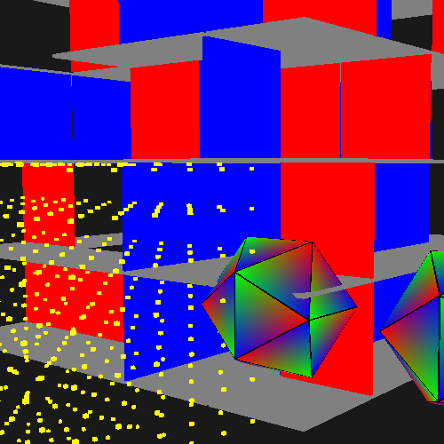

# Native/SDL starter kit

[](https://travis-ci.org/proppy/native-sdl-starter-kit)

SDL template for developing portable native mobile application.

It bundles the official template for android and iOS from the [SDL project](https://www.libsdl.org/).

## Pre-requisites

- [Android NDK](https://developer.android.com/tools/sdk/ndk/index.html)
- [Xcode](https://developer.apple.com/xcode/)

## Usage

- Bootstrap a new project
```
git clone --recursive https://github.com/proppy/native-sdl-starter-kit.git my-project
cd my-project
```

- Android build & deploy
```
cd android
android update project -p .
ndk-build
ant debug
adb install -r bin/SDLActivity-debug.apk
```

- iOS project
```
cd ios
open nativesdldemo.xcodeproj
```

- Desktop build & run
```
cd desktop
cmake .
make
./native-sdl-demo
```
